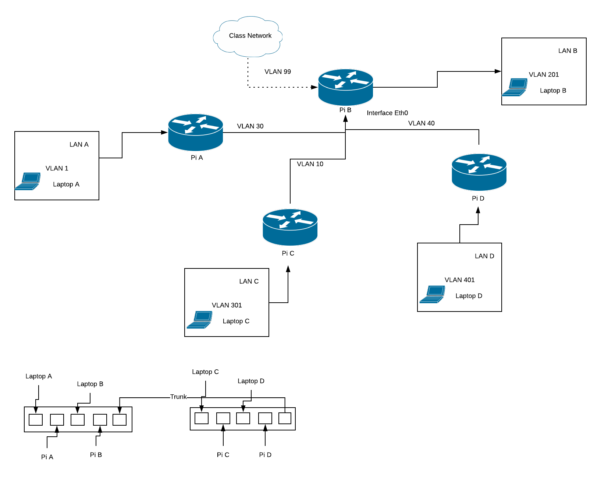

# Raspberry Pi LAN/WAN Linux Networking Project
INFO 314 A  
Group 2:  
Jarett Lund-Hopkins, Seth Anderson, Justin Park, Jeremiah Chang  
  
## Executive Summary  

In this project, a small internetwork was created using four Raspberry Pi's acting as BGP routers in tandem with one another. One Pi acted as an ISP, routing the other Pi's to the global internet, while the others acted as edge routers, sending packets from the ISP to their own LAN. They were connected using two 8-port ethernet switches. This project taught us a lot about BGP routing, linux bash, DHCP, the OSI model, and DNS. 

Since we were a team of four, we had a lot of options on how we could set up our switch. For simplicity we chose to have only one ISP and simply trunk the two switches together. We decided to place to LANs and routers on each switch. Switch A was configured to have both the ISP and the uplink port to the class. While we could have had two ISPs, we chose only one because it would involve less configuration. We trunked the two switches together via port #5 and ran into some problems doing so. Because our setup involves two switches, we needed to be able to adopt both switches under a single Unifi Controller. We had various issues trying to adopt the second switch but were able to resolve them by hard resetting the second switch and utilizing the default admin username and password for it. Once we adopted the second switch, the rest of the port configuration was easy.
  
Another issue we experienced was setting up our TLD server on Docker. The TLD server was up on Pi D, but Pi D was the only device that could reach the server at 10.10.10.10. Even though we believe we closely watched the video and followed its instructions, it wasn't set up correctly. After going through various throubleshooting to make sure the container was running and everyone had their zones set up correctly, we eventually realized that the TLD server wasn't properly set up on BGP even though we followed the instructions because the BGP configuration was not saved properly inside the `vtysh` shell. Once we reimputed the commands for the BGB configuration for the TLD server, and properly using `write mem ory`, we could see the configuration in the running config. After that everyone was able to reach the TLD server at 10.10.10.10 and use it to resolve each others name/mail servers. 

## Network Diagram  

## Configuration Summary  

### Group Configuration
**Group Number:** 2  
**Group Network Subnet:** 172.21.12.0/22  
**Group Autonomous Systems Number Range:** 65020-65024  

***

### Pi A
 
**Name:** Seth Anderson  
**Notes:** Edge Router, Unifi Management Controller  

**Switch Ports:** Switch A 1 (Laptop A), Switch A 2 (Pi A)  
**Switch A Port 1,2 Native VLAN ID(s):** 1  
**Switch A Port 2 Tagged VLAN ID(s):** 10  
**LAN # (on diagram):**  LAN A  
**LAN VLAN ID:** VLAN 1  
**Routing Link VLAN ID:** 10  

**Group Member Subnet:** 172.21.12.0/24  

**Public Network Subnet:** 172.21.12.0/25  
**Public Domain Name:** barryuw.pi  
**Public Authoritative Name Server Domain:** cat.barryuw.pi  
**Public Authoritative Name Server IP:** 172.21.12.1  
**Public Mail Server Domain:** duck.barryuw.pi  
**Public Mail Server IP:** 172.21.12.2  

**Autonomous System Number:** 65021  
**BGP Router ID:** 172.21.12.3  
**Private Network Subnet:**  172.21.12.128/25  
**Private Domain Name:** priv.barryuw.pi  
**Private Authoritative Name Server Domain:** cat.priv.barryuw.pi  
**Private Authoritative Name Server IP:** 172.21.12.129  
**Private Mail Server Domain:** duck.priv.barryuw.pi  
**Private Mail Server IP:** 172.21.12.130  

***

### Pi B
 
**Name:** Jarett Lund-Hopkins  
**Notes:** ISP (Core Router)   

**Switch Ports:** Switch A 3 (Laptop B), Switch A 4 (Pi A)  
**Port 3, 4 Native VLAN ID(s):** 201  
**Port 4 Tagged VLAN ID(s):**  10, 30, 40, 99  
**LAN # (on diagram):** LAN B  
**LAN VLAN ID:** VALN 201  
**Routing Link VLAN ID:** 10, 30, 40, 99  

**Group Member Subnet:** 172.21.13.0/24  

**Public Network Subnet:** 172.21.13.0/25  
**Public Domain Name:** oreoicecream.pi  
**Public Authoritative Name Server Domain:** dns.oreoicecream.pi  
**Public Authoritative Name Server IP:** 172.21.13.1  
**Public Mail Server Domain:** mta.oreoicecream.pi  
**Public Mail Server IP:** 172.21.13.2  

**Autonomous System Number:** 65022  
**BGP Router ID:** 172.21.13.3  
**Private Network Subnet:**  172.21.13.128/25  
**Private Domain Name:** lan.oreoicecream.pi  
**Private Authoritative Name Server Domain:** pandafish.lan.oreoicecream.pi  
**Private Authoritative Name Server IP:** 172.21.13.129  
**Private Mail Server Domain:** mta.lan.oreoicecream.pi  
**Private Mail Server IP:** 172.21.13.130  

***

### Pi C
 
**Name:** Jerimiah Chang  
**Notes:**  Edge Router  

**Switch Ports:** Switch B 1 (Laptop C), Switch B 2 (Pi C)  
**Port 1, 2 Native VLAN ID(s):** 301
**Port 2 Tagged VLAN ID(s):** 30  
**LAN # (on diagram):**  LAN C  
**LAN VLAN ID:** VLAN 301  
**Routing Link VLAN ID:** 30  

**Group Member Subnet:** 172.21.14.0/24  

**Public Network Subnet:** 172.21.14.0/25  
**Public Domain Name:** odegaardstairs.pi  
**Public Authoritative Name Server Domain:** ns.odegaardstairs.pi  
**Public Authoritative Name Server IP:** 172.21.14.1  
**Public Mail Server Domain:** mx01.odegaardstairs.pi  
**Public Mail Server IP:** 172.21.14.2   

**Autonomous System Number:** 65023  
**BGP Router ID:** 172.21.14.3  
**Private Network Subnet:**  172.21.14.128/25  
**Private Domain Name:** lan.odegaardstairs.pi  
**Private Authoritative Name Server Domain:** ns.lan.odegaardstairs.pi  
**Private Authoritative Name Server IP:** 172.21.14.129  
**Private Mail Server Domain:** mx01.lan.odegaardstairs.pi  
**Private Mail Server IP:** 172.21.14.130  

***

### Pi D
 
**Name:** Justin Park  
**Notes:**  Edge Router, TLD Server (Docker)  

**Switch Ports:** Switch B 3 (Laptop D), Switch B 4 (Pi D)  
**Port 3, 4 Native VLAN ID(s):** 401  
**Port 3 Tagged VLAN ID(s):** 40  
**LAN # (on diagram):** LAN D  
**LAN VLAN ID:** VLAN 401  
**Routing Link VLAN ID:** 40  

**Group Member Subnet:** 172.21.15.0/24  

**Public Network Subnet:** 172.21.15.0/25  
**Public Domain Name:** lion.pi  
**Public Authoritative Name Server Domain:** ns.lion.pi  
**Public Authoritative Name Server IP:** 172.21.15.1  
**Public Mail Server Domain:** mx01.lion.pi  
**Public Mail Server IP:** 172.21.15.2  

**Autonomous System Number:** 65024  
**BGP Router ID:** 172.21.15.3  
**Private Network Subnet:**  172.21.15.128/25  
**Private Domain Name:** local.lion.pi  
**Private Authoritative Name Server Domain:** ns.local.lion.pi  
**Private Authoritative Name Server IP:** 172.21.15.129  
**Private Mail Server Domain:** mx01.local.lion.pi  
**Private Mail Server IP:** 172.21.15.130  